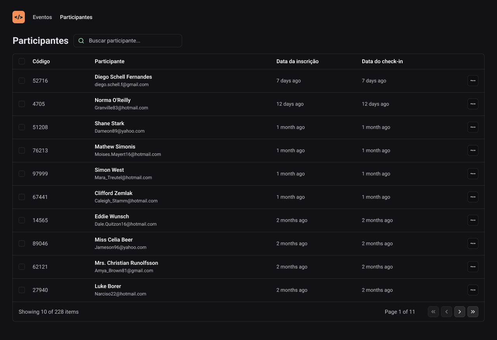

# Nlw Unite - ReactJS + Vite + Tailwind + Typescript

# Essa aplicação foi desenvolvida durante o NLW Unite da Rocketseat utilizando React, TypeScript, Tailwind e a SpeechRecognition API.

# Executando
Após clonar o repositório, acesse a pasta do projeto e execute os comandos abaixo:

`
 npm install
`
`
 npm run dev
`

- Acesse http://localhost:5173 para visualizar a aplicação.
